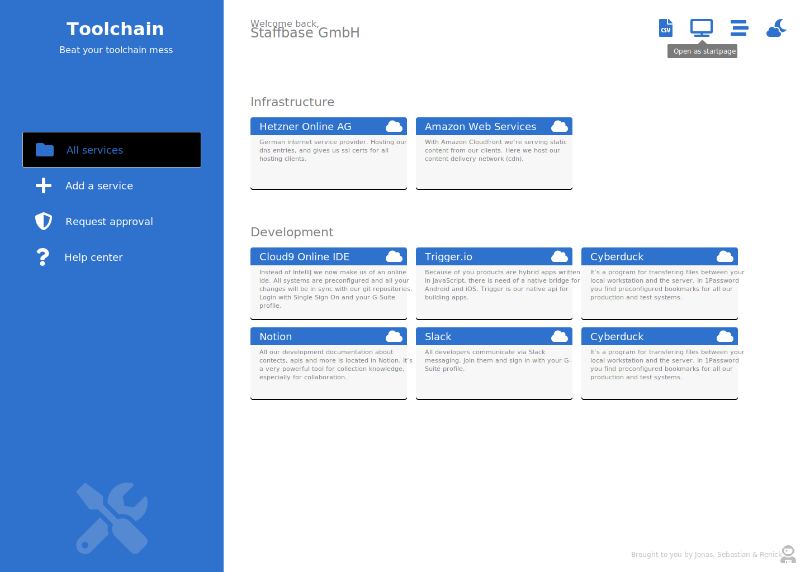
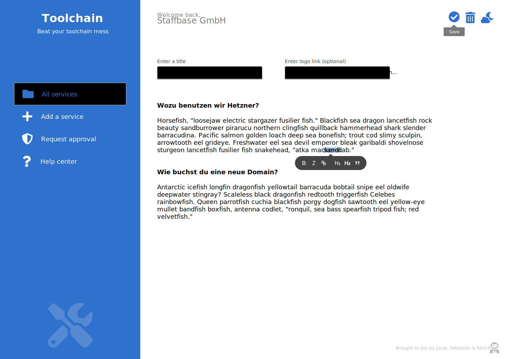
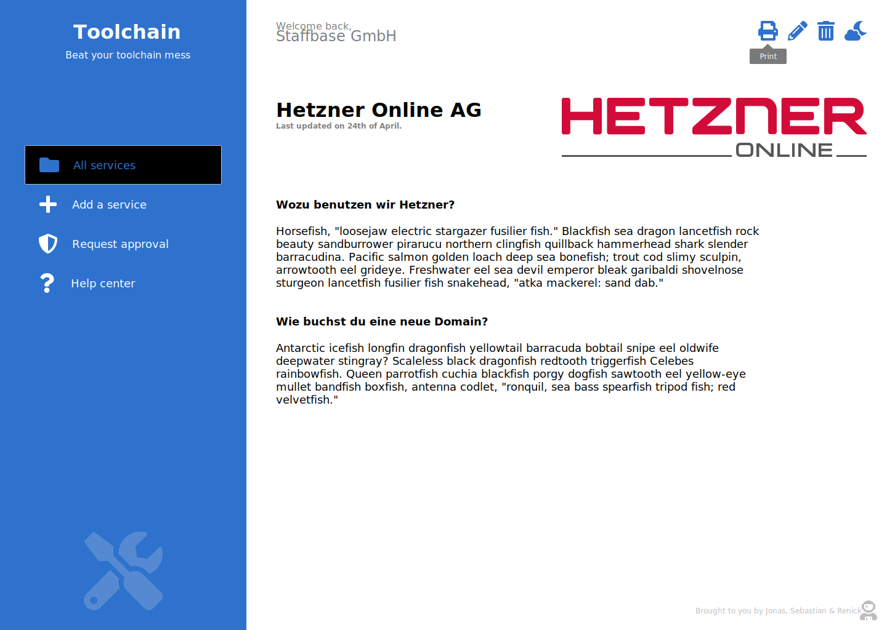

# Toolchain

## Gliederung:

1. Einleitung, Allgemeines
2. Titel
3. Skizze/Beschreibung
4. Anforderungen (Lastenheft)
5. allgemein zum Projekt
6. Team-Mitglieder und Entwicklung (insbesondere Teamleiter)
7. Archiketur (kurz!)
8. Timeline Milestones
9. Bug-Liste (optional)

## 1. Einleitung

Dieses Projekt entstand im Rahmen des Moduls "Objektorientierte Progr. und Entwickl. (3IM-OOP-IM)" des MedieninformatikStudium im 2. Semester. 
Das Ziel war die Erstellung einer Web-App mit der die Werkzeuge (Tools) der Mitarbeiter eines Unternehmens erfasst werden sollen, sodass diese jederzeit nachgeschaut werden kann wer mit welchem Tool arbeitet und es für was nutzt.

Das Main-Git-Repo findet man unter: [renickbuettner/toolchain](https://github.com/renickbuettner/toolchain) 

Ein zweites Git-Repo für Medieninhalte, Coperate Design, Icons und sonstige Medien findet man unter: [seppel3599/toolchain-media](https://github.com/seppel3599/toolchain-media)

Zum Testen der App kann man die Schrittfolge in der [README](https://github.com/renickbuettner/toolchain/blob/master/readme.md) nachlesen oder die [Testseite](https://renick.io/) nutzen. Für den Fall des lokalen Betriebs bitte die Voraussetzungen in der README beachten. 

## 1. Titel

Der Name **Toolchain** kommt von der Funktion bzw. Sinn der App: Das Verketten bzw. zur Verfügung stellen von Werkzeugen.

## 2. Skizze und Beschreibung

Ein Werkzeug zum Organisieren der in einem Unternehmen genutzten Software, Webseiten und anderer Tools.
Die Objektorietierung findet in PHP statt. Als Framework haben wir uns für Laravel entschieden und einer SQL-Datenbank. Das Frontend soll mit JavaScript gebaut werden.

Mookups zur App, die Mitte Mai 2019 entstanden sind:

## 3. Anforderungen (Lastenheft)

### Mindestumfang

Als Ziele bzw. Mindestfunktion um eine bereit einsatzfähige App zu erhalten, haben wir uns folgende Anforderungen überlegt:

- Web-App mit Laravel:
  - erstellen, editieren und löschen von Einträgen für Werkzeuge mit Titel, Beschreibung, Bildern, Logos die jeder Nutzer selber anlegen kann
  - Globale Übersicht, kategorisiert
  - Exportfunktion

### Mögliche Erweiterungen
  
Weiterhin haben ebenfalls mögliche Erweiterungen formuliert die bei frühzeitiger Fertigstellung noch umgesetzt werden sollten:

- Login mit Single Sign-On (Google)
- completly responsive 
- Integration einer personalisierten Suchmachine mit persönlichen Informationen (Cyberduck, Google)

## 5. Team-Mitglieder und Entwicklung

Das Team setzt sich folgendermaßen mit zusammen: 

- Renick Büttner
  - **Teamleitung**
  - Webdevelopment
  - Backend
- Jonas Wagner
  - Webdevelopment
  - Frontend
- Sebastian Walter
  - Grafiken (Diagramme, Icons, ...)
  - Design (Mini-CD)
  - Präsentation
  - Dokumentation

## 6. Aufgabenverteilung

Bei der Aufgabenverteilung konnten wir uns im allgemeinen ziemlich schnell einigen. Das Herr Büttner die Aufgaben des Teamleiters/Projektmanagers übernimmt war aufgrund seiner Erfahrung bei solchen Projekten. Weiterhin haben Herr Wagner und Herr Büttner bereits eingehende Erfahrung mit PHP bzw. direkt mit dem Laravel Framework. 

### genaue Aufgabenverteilung:

- Sebastian Walter
  - Entwurf und Umsetzung der Icons
    - Navigation
    - ??Schnelleditierungsmenü
  - Mini-CD
    - Schriftarten festlegen
    - Farbtheme festlegen
    - Logo und Schriftzug entwerfen und umsetzen
  - Erstellen der Dokumentation
    - Schreiben
    - Formatierung und Layouten
  - Erstellen der Präsentation
    - Schreiben
    - Formatierung und Layouten
- Renick Büttner
  - Git-Repo
    - Initialisieren und Verwalten
  - Projektmangament - Webdev
    - Aufgaben Definition und Verteilung
  - Entwurf - Prototyp
  - Projektidee
- Jonas Wagner
  - Frontend
    - CSS und JS

## 6. Architektur 

@Renick: Bitte **kurz** die Architektur beschreiben!
@Sebastian: unbedingt noch die UML-Diagramme ergänzen

## 7. Timeline, Milestones

- Anfang Mai: Projektidee durch Renick 
- Anfang Mai: Projektentwicklung und Definition durch alle
- Anfang Mai: Apsrache mit Professor Hara und Input für die Idee
- Anfang Mai: Github-Repository erstellen und initalisieren durch Renick ⇒ [Toolchain](https://github.com/renickbuettner/toolchain/issues)
- Mitte Mai: Entwurf von Mookups
- Mitte Mai: Definition der Anforderungen -> kleines Lastenheft
- Mitte Mai: Erste Aufgaben werden in Notion definitiert und verteilt
- Mitte Mai: Abgabe der Projektidee an Professor Hara
- Erste Commits durch Renick
  - Erstellen der Login-Maske
- Erstellen eines eigenen Repositories für die Medieninhalte, Dokumentation und Informationen zum Design durch Sebastian ⇒ [Toolchain-Media](https://github.com/seppel3599/toolchain-media)
- Längere Pause: durch Prüfungen
- Juli: Entwurf und Umsetzung der Icons durch Sebastian
- Juli: Fortsetzen der Arbeit an der Web-App durch Renick und Jonas
- Anfang August: Schreiben der Dokumentation

erste Lauffähige Version; Laravel-Import; wann, welche Version mit welchen Funktion, 

## 8. Bug-Liste

Wenn es welche gibt! ;)

