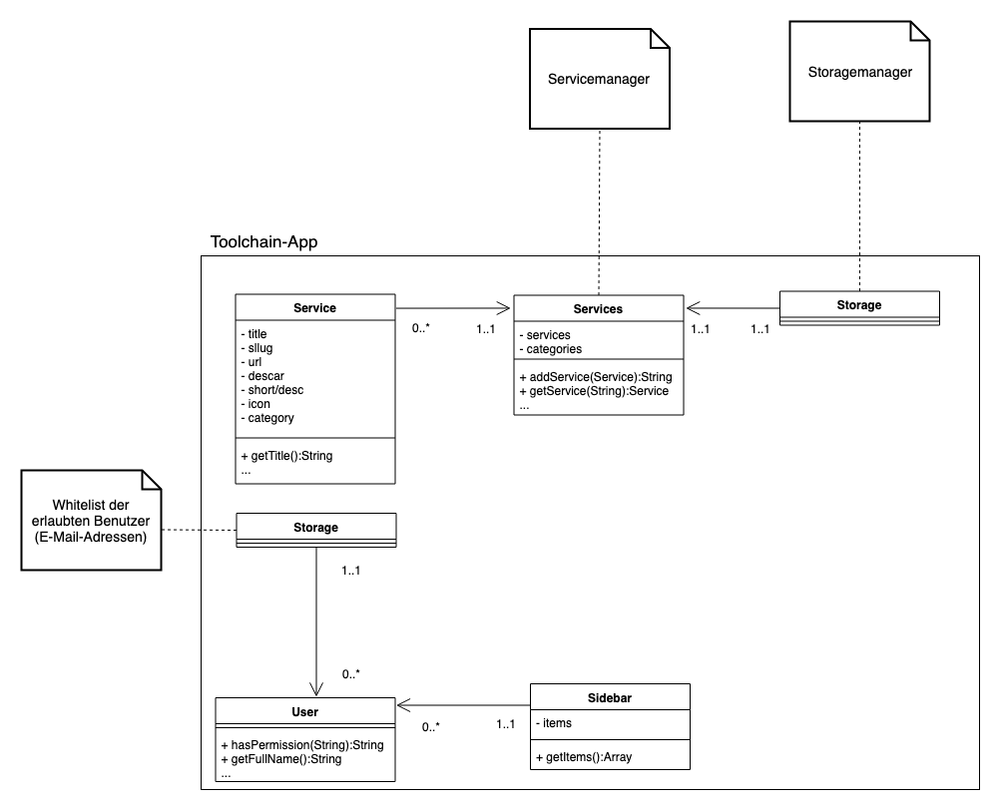

# Toolchain-Dokumentation

###Leistung für das Modul: Objektorientierte Progr. und Entwickl. (3IM-OOP-IM)

## Gliederung:

1. Einleitung, Allgemeines
2. Titel
3. Skizze/Beschreibung
4. Anforderungen (Lastenheft)
5. Team-Mitglieder und Entwicklung
6. Aufgabenverteilung
7. Architektur
8. Timeline Milestones
9. Bugs, Verbesserungen

## 1. Einleitung

Dieses Projekt entstand im Rahmen des Moduls "Objektorientierte Progr. und Entwickl. (3IM-OOP-IM)" des Medieninformatik Studiums im 2. Semester. 
Das Ziel war die Erstellung einer Web-App, mit welcher die Werkzeuge (Tools) eines Unternehmens erfasst werden können. In Folge dessen kann jeder Mitarbeiter alle genutzten Tools auf einen Blick erfassen und nutzen.

Das Main-Git-Repo findet man unter: [renickbuettner/toolchain](https://github.com/renickbuettner/toolchain) 

Ein zweites Git-Repo für Medieninhalte, Coperate Design, Icons und Sonstiges findet man unter: [seppel3599/toolchain-media](https://github.com/seppel3599/toolchain-media)
 
Zum Testen der App kann man die Schrittfolge in der [README](https://github.com/renickbuettner/toolchain/blob/master/readme.md) nachlesen oder die [Demoseite](https://toolchain.renick.io/) nutzen, die Login-Daten finden Sie in unserer Abgabe-Mail. Für den Fall des lokalen Betriebs bitte die Voraussetzungen in der README beachten. 

## 2. Titel

Der Name **Toolchain** leitet sich aus der Funktion der App ab: Verketten bzw. Zurverfügungstellen von Werkzeugen. Dabei geht es zentral darum, eine Oberfläche zu bieten, welche eine Übersicht über alle Dienste und Werkzeuge einer Firma liefert. Über diese Verlinkungen lassen sich Tools wie Jira, Confluence, Github uvm. auflisten, sowie individuell erläutern. Eine Liste dieser Dienste kann gedruckt oder als PDF über den Browser aufgerufen werden, um z.B. Neuankömmlingen den Einstieg zu erleichtern.

## 3. Skizze und Beschreibung

Ein Werkzeug zum organisieren der in einem Unternehmen genutzten Software, Webseiten und anderer Tools.
Die Objektorientierung findet in PHP statt. Wir nutzen das PHP Framework Laravel und eine simple sqlite-Datenbak. Das Frontend wurde mit JavaScript gebaut.

Mookups zur App, die Mitte Mai 2019 entstanden sind:

## 4. Anforderungen (Lastenheft)

### Mindestumfang

- Web-App mit Laravel:
  - erstellen, editieren und löschen von Einträgen verschiedenster Tools mit Titel, Beschreibung, Bildern und Logos die jeder Nutzer selber anlegen kann
  - Globale Übersicht, kategorisiert
  - Exportfunktion

### Mögliche Erweiterungen

Weiterhin haben wir ebenfalls mögliche Erweiterungen formuliert die bei frühzeitiger Fertigstellung noch umgesetzt werden sollten:

- Login mit Single Sign-On (Google)
- Completly responsive
- Integration einer personalisierten Suchmaschine mit persönlichen Informationen (Cyberduck, Google)

## 5. Team-Mitglieder und Entwicklung

**@Renick @Jonas Bitte ergänzen/korrigieren!**

Das Team setzt sich folgendermaßen zusammen: 

- Renick Büttner
  - **Teamleitung**
  - Webdevelopment
  - Backend
  - Dokumentation
- Jonas Wagner
  - Webdevelopment
  - Frontend
  - Testing
  - Bug fixing
  - Dokumentation
- Sebastian Walter
  - Dokumentation
  - Grafiken
  - Design
  - Präsentation

## 6. Aufgabenverteilung

**@Renick @Jonas Bitte ergänzen/korrigieren!**

Bei der Aufgabenverteilung konnten wir uns im allgemeinen ziemlich schnell einigen. Renick übernahm auf Grund seiner mehrjährigen Entwicklererfahrung die Aufgaben des Teamleiters/Projektmanagers. Da neben Renick auch Jonas über PHP-Grundkenntnisse verfügt, teilten die Beiden sich die Roller des Entwicklers. Für ein Projekt dieses Umfanges wollten wir weiterhin ungern den Programmieraufwand auf alle Teammitglieder verteilen, um Absprachen und Rückfragen nicht ins unermessliche zu steigern. So fielen die Rahmentätigkeiten zu Sebastian. Der sich im Folgenden um die Gestaltung der App, Design, Dokumentation, Absprachen und auch um die Abgabe kümmerte.

### genaue Aufgabenverteilung:

- Renick Büttner
  - Git-Repo
    - Initialisierung und Verwaltung
  - Projektmangament - Webdevelopment
    - Aufgaben Definition und Verteilung
  - Entwurf des Prototyps/Mookups
  - Projektidee
  - Dokumentation 
    - Gegenlesen
- Jonas Wagner
  - Frontend
    - CSS und JS
  - Google SSO
  - Blackbox-Tests
  - Erweiterung um kleinere Features
  - Dokumentation 
    - Gegenlesen
- Sebastian Walter
  - Entwurf und Umsetzung der Icons
    - Navigation, Button, Schnelleditierungsmenü
  - Diagramme (Klassendiagramm)
  - Design und Mini-CD
    - Schriftarten, Farbtheme festlegen
    - Logo und Schriftzug entwerfen und umsetzen
  - Erstellen der Dokumentation
  - Erstellen der Präsentation
    - Sprechanteile und Themen festlegen
    - Formatierung und Layout

## 7. Architektur 

Die Web-App baut auf dem Open Source Framework Laravel auf, und speichert alle Inhalte im Flat-File Format in einer Ordnerstruktur. Ein Im- und Export der Inhalte ist deswegen einfach zu handhaben. Als Datenaustauschformat kommt JSON zum Einsatz. Der Editor läuft über JavaScript im Browser und sendet Anfragen mit einem serialisierten JSON-Objekt an das Backend. Hierfür gibt es eine rudimentäre API, welche sich die HTTP-Methoden zunutze macht.

Die Authentifizierung erfolgt über ein Single Sign-on mit einem Google Account. Es können in einer Whitelist-Datei alle Email-Adressen hinterlegt werden, die sich in der App einloggen dürfen. Anhand dieser Liste wird auch unterschieden in Personen, die Inhalte sehen und erstellen dürfen.

Das Backend rendert alle Seiten mithilfe von Blade-Templates, und liefert ein JavaScript-Bundle dazu aus. Alle Inhalte, die auf einer Seite benötigt werden, initialisieren sich dann beim Laden der Seite im Client.

Im JavaScript-Code gibt es einen API-Client, der zentral mit dem Backend interagieren kann. Im Frontend wird das Bootstrap Framework, sowie Axios (Xhttprequest Library) verwendet.

Klassendiagramm der implemetierten Klassen der App

## 8. Timeline, Milestones

Die Timeline lässt sich am besten über die Github Commits & PRs verfolgen.

**@Renick @Jonas Bitte ergänzen/korrigieren!**

- Anfang Mai: Projektidee durch Renick 
- Anfang Mai: Projektentwicklung und Definition durch alle
- Anfang Mai: Absprache mit Professor Hara und Input für die Idee
- 6.Mai: Github-Repository erstellen und initialisieren durch Renick ⇒ [Toolchain](https://github.com/renickbuettner/toolchain/issues)
- Mitte Mai: Entwurf der Mookups
- Mitte Mai: Definition der Anforderungen -> kleines Lastenheft
- Mitte Mai: Erste Aufgaben werden in Notion definiert und verteilt
- Mitte Mai: Abgabe der Projektidee an Professor Hara
- Erste Commits durch Renick
    - Laravel-Basis importieren
    - Erstellen der Login-Maske
- 18.Juni: Erstellen eines eigenen Repositories für die Medieninhalte, Dokumentation und Informationen zum Design durch Sebastian ⇒ [Toolchain-Media](https://github.com/seppel3599/toolchain-media)
- Danach folt eine längere Pause aufgrund der Klausurvorbereitung
- Juli: Entwurf und Umsetzung der Icons durch Sebastian
- Juli: Fortsetzen der Arbeit an der Web-App durch Renick und Jonas
- Anfang August: Schreiben der Dokumentation
- Ende August: Letzte Abstimmungen mit Professor Hara
- Ende August: Abgabe

@Renick @Jonas: erste Lauffähige Version; Laravel-Import; wann, welche Version mit welchen Funktion, 

## 9. Bugs, Verbesserungen

- TinyMCE hat noch keinen Support für die Toolchain-Standardschrift
- Verbesserungsvorschlag:   
    - Autocomplete für Kategorien, damit Dopplungen ähnlicher Kategorien vermieden werden
    - Link zum Service auf dessen personalisierter Service Seite
        
